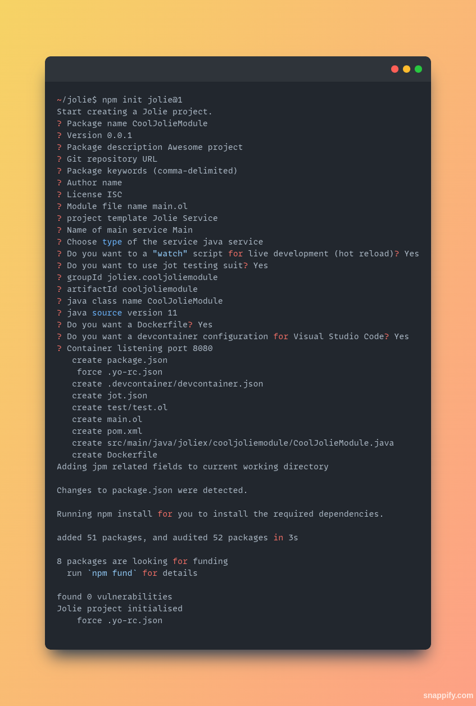

<!-- Improved compatibility of back to top link: See: https://github.com/othneildrew/Best-README-Template/pull/73 -->
<a name="readme-top"></a>
<!--
*** Thanks for checking out the Best-README-Template. If you have a suggestion
*** that would make this better, please fork the repo and create a pull request
*** or simply open an issue with the tag "enhancement".
*** Don't forget to give the project a star!
*** Thanks again! Now go create something AMAZING! :D
-->

<!-- PROJECT LOGO -->
<br />
<div align="center">
  <a href="https://github.com/jolie/create-jolie">
    
  </a>

<div align="center">
  <h3 align="center">Jolie create</h3>

  <p align="center">
    A Jolie module generator
    <br />
    <a href="https://github.com/jolie/create-jolie"><strong>Explore the docs »</strong></a>
    <br />
    <br />
    <a href="https://github.com/jolie/create-jolie">View Demo</a>
    ·
    <a href="https://github.com/jolie/create-jolie/issues">Report Bug</a>
    ·
    <a href="https://github.com/jolie/create-jolie/issues">Request Feature</a>
  </p>
</div>
</div>

<!-- TABLE OF CONTENTS -->
<details>
  <summary>Table of Contents</summary>
  <ol>
    <li>
      <a href="#about-the-project">About The Project</a>
      <ul>
        <li><a href="#built-with">Built With</a></li>
      </ul>
    </li>
    <li><a href="#usage">Usage</a></li>
    <li><a href="#roadmap">Roadmap</a></li>
    <li><a href="#contributing">Contributing</a></li>
    <li><a href="#license">License</a></li>
    <li><a href="#contact">Contact</a></li>
    <li><a href="#acknowledgments">Acknowledgments</a></li>
  </ol>
</details>

<!-- ABOUT THE PROJECT -->
## About The Project

<!-- [![Product Name Screen Shot][product-screenshot]](https://example.com) -->



This project contains scripts used for scaffolding a Jolie project. With this tool, you can easily jumpstart the jolie project with the structure recommended by the Jolie developer. It is included the configuration for enable `jpm` directly to the project, and possible to integrate `jot` to the project for testing.

<p align="right">(<a href="#readme-top">back to top</a>)</p>

### Built With

* [Yeoman][yeoman]

<p align="right">(<a href="#readme-top">back to top</a>)</p>

<!-- USAGE EXAMPLES -->
## Usage

``` bash
npm init jolie@1
```

Note the version number needed to be specify, otherwise the `npm` might resolve the script to an outdated cached version in the local machine.

## Type of project

With this tool, you can pick various type of Jolie project, from simple project to advance jolie project such as Java service or web application. Currently create-jolie supports following project types.

* Empty Jolie project
* Scripting Jolie project
* Web application project

<p align="right">(<a href="#readme-top">back to top</a>)</p>

<!-- ROADMAP -->
## Roadmap

* [ ] Create new module in existed project

See the [open issues](https://github.com/jolie/create-jolie/issues) for a full list of proposed features (and known issues).

<p align="right">(<a href="#readme-top">back to top</a>)</p>

<!-- CONTRIBUTING -->
## Contributing

The project consists of a yeoman generator cooperating with sub-generators. The generators are stored inside `./generators` directory, which categorized in the type of available jolie's project. The entry point of the generators is reside under `./app` directory.

Contributions are what make the open source community such an amazing place to learn, inspire, and create. Any contributions you make are **greatly appreciated**.

If you have a suggestion that would make this better, please fork the repo and create a pull request. You can also simply open an issue with the tag "enhancement".
Don't forget to give the project a star! Thanks again!

1. Fork the Project
2. Create your Feature Branch (`git checkout -b feature/AmazingFeature`)
3. Commit your Changes (`git commit -m 'Add some AmazingFeature'`)
4. Push to the Branch (`git push origin feature/AmazingFeature`)
5. Open a Pull Request

<p align="right">(<a href="#readme-top">back to top</a>)</p>

<!-- LICENSE -->
## License

Distributed under the MIT License. See `LICENSE` for more information.

<p align="right">(<a href="#readme-top">back to top</a>)</p>

<!-- CONTACT -->
## Contact

* Our GitHub repository, in the forms of discussion threads, issues, and pull requests.
* Chat or Audio/Video calls. See below for a link to our Discord server.

### Discord

<p align="center">
 <a href="https://discord.gg/yQRTMNX"></a>
</p>

<p align="right">(<a href="#readme-top">back to top</a>)</p>

<!-- MARKDOWN LINKS & IMAGES -->
<!-- https://www.markdownguide.org/basic-syntax/#reference-style-links -->

[yeoman]: https://yeoman.io/
